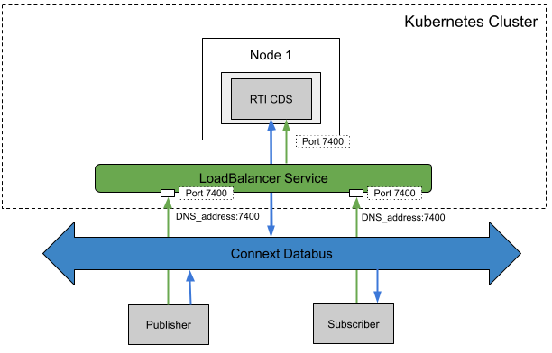

## Peer-to-Peer Communication with Participants behind Cone NATs Using Cloud Discovery Service using a Load Balancer

### Problem

You want 2 DDS applications outside a K8s cluster to communicate with each other, but none of their public IP addresses is known. Plus, you would like to use a Load Balancer that will also give you a DNS address. This is a similar use case of [this](../cds_wan_point_to_point_node_port).

### Solution

To solve this, **Cloud Discovery Service** is used to resolve the public IP address of the 2 applications. The **Load Balancer** will expose CDS on a static port on the known public IP address of the cluster, with a DNS address.

#### Required Components:

* **DDS Publisher** and **DDS Subscriber** are example applications that need to exchange data. They are both behind Cone NATs. If they are not, this example won't work. You can check if they're behind a Cone NAT by following the instructions in this repository: https://github.com/songjiayang/natat
* **Load Balancer**: We create a **Load Balancer** that exposes **Cloud Discovery Service** at a static port (e.g. Port 7400 in the figure). For the public IP address, we will use the given DNS name. Then, the **external participant (DDS Publisher)** can contact the **Cloud Discovery Service** by requesting DNS_address:NodePort (e.g. a7xx-yy.zz.amazonaws.com:7400, DNS_address:7400 in the figure). The **external participant (DDS Subscriber)** will do the same thing. After that, **Cloud Discovery Service** will resolve their IP addresses and put them both in contact so they can start a point-to-point communication without further need from CDS.

### Required Docker Images
- [RTI Cloud Discovery Service](../dockerfiles/rti_clouddiscoveryservice)
- [RTI DDS Ping Publisher](../dockerfiles/rti_ddsping_pub)
- [RTI DDS Ping Subscriber](../dockerfiles/rti_ddsping_sub)

### Steps

#### 1. Create a ConfigMap for RTI License.
`$ kubectl create configmap rti-license --from-file rti_license.dat`

#### 2. Create a LoadBalancer Service for CDS. 
`$ kubectl create -f public_cds/cds-lb.yaml`

After this step, AWS will provide a DNS address (e.g., a7xx-yy.zz.amazonaws.com) for the Load Balancer Service. You should use the DNS address in your RT WAN configurations in steps 4, 7 and 8.

`$ kubectl get services cds-rwt`

If you are interested, you can see the DNS address get resolved some minutes after deployming the Load Balancer:

`$ nslookup a7xx-yy.zz.amazonaws.com`

#### 4. Create a ConfigMap for the CDS XML configuration file
`$ kubectl create configmap cds-rwt-configmap --from-file=public_cds/cds-config.xml`

#### 5. Create a Deployment for CDS. You should update the specific IP address and ports in this file.
`$ kubectl create -f public_cds/cds-deployment.yaml`

#### 6. Set these environment variable before launching the publisher and subscriber. For example:
`export CDS_PUBLIC_IP=a7xx-yy.zz.amazonaws.com`
`export CDS_PUBLIC_PORT=7400`

#### 7. Run the external publisher (outside the cluster).
`$ rtiddsping -pub -qosFile rwt_participant.xml -qosProfile RWT_Demo::RWT_Profile -domainId 100`

#### 8. Run the external subscriber (outside the cluster).
`$ rtiddsping -sub -qosFile rwt_participant.xml -qosProfile RWT_Demo::RWT_Profile -domainId 100`