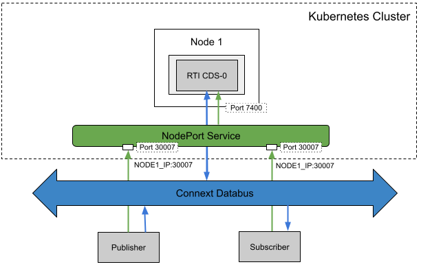

## Peer-to-Peer Communication with Participants behind Cone NATs Using Cloud Discovery Service and a NodePort

### Problem

You want 2 DDS applications outside a K8s cluster to communicate with each other, but none of their public IP addresses is known.

### Solution

To solve this, **Cloud Discovery Service** is used to resolve the public IP address of the 2 applications. The **NodePort Service** will expose CDS on a static port on the known public IP address of the cluster.

#### Required Components:

* **DDS Publisher** and **DDS Subscriber** are example applications that need to exchange data. They are both behind Cone NATs. If they are not, this example won't work. You can check if they're behind a Cone NAT by following the instructions in this repository: https://github.com/songjiayang/natat
* **NodePort Service**: We create a **NodePort Service** that exposes **Cloud Discovery Service** at a static port (e.g. Port 30007 in the figure). Then, the **external participant (DDS Publisher)** can contact the **Cloud Discovery Service** by requesting NodeIP:NodePort (e.g. NODE2_IP:30007 in the figure). The **external participant (DDS Subscriber)** will do the same thing. After that, **Cloud Discovery Service** will resolve their IP addresses and put them both in contact so they can start a point-to-point communication without further need from CDS.

### Required Docker Images
- [RTI Cloud Discovery Service](../dockerfiles/rti_clouddiscoveryservice)
- [RTI DDS Ping Publisher](../dockerfiles/rti_ddsping_pub)
- [RTI DDS Ping Subscriber](../dockerfiles/rti_ddsping_sub)

### Steps

#### 1. Create a ConfigMap for RTI License.
`$ kubectl create configmap rti-license --from-file rti_license.dat`

#### 2. Create a ConfigMap for the CDS XML configuration file
`$ kubectl create configmap cds-rwt-configmap --from-file=public_cds/cds-config.xml`

#### 3. Set the CDS_PUBLIC_IP variable in this file and create a Deployment and a Service for Cloud Discovery Service.
`$ kubectl create -f public_cds/cds-statefulset.yaml`

#### 4. Create a NodePort Service for the CDS
`$ kubectl create -f public_cds/cds-nodeport.yaml`

#### 5. Set these environment variable before launching the publisher and subscriber. For example:
`$ export CDS_PUBLIC_IP=54.177.131.196`
`$ set CDS_PUBLIC_PORT=30007`

#### 5. Run the external publisher (outside the cluster).
`$ rtiddsping -pub -qosFile rwt_participant.xml -qosProfile RWT_Demo::RWT_Profile -domainId 100`

#### 6. Run the external subscriber (outside the cluster).
`$ rtiddsping -sub -qosFile rwt_participant.xml -qosProfile RWT_Demo::RWT_Profile -domainId 100`
