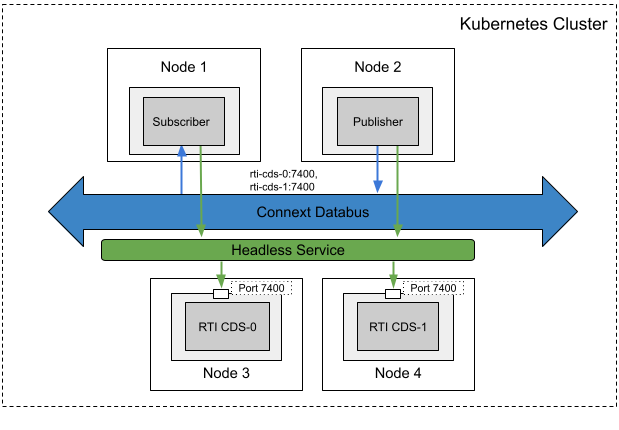

## Scenario 1 - Communications Between Pods Inside a Kubernetes Cluster via Unicast Discovery

### Problem

You want to enable DDS discovery within a Kubernetes cluster without relying on multicast. This is especially relevant as many Container Network Interface (CNI) plugins in Kubernetes do not support multicast.

### Solution

To address the multicast limitation in Kubernetes, you can leverage **RTI Cloud Discovery Service (CDS)**. CDS provides a solution for DDS discovery in environments where multicast is not supported. To use CDS, you need to add the IP address or DNS name and port number of the CDS to the initial peer lists of your Connext DDS applications. To get a stable IP address or DNS name within Kubernetes, you can employ a Cluster IP Service. Cluster IP is the default type of k8s service and exposes a pod on a stable internal IP in the cluster. With this, the pod for RTI CDS is reachable by DDS applications via a stable IP address or DNS name (e.g. rti-clouddiscovery:7400).

### Required Docker Images
- [RTI Cloud Discovery Service](../dockerfiles/rti_clouddiscoveryservice)
- [RTI DDS Ping Publisher](../dockerfiles/rti_ddsping_pub)
- [RTI DDS Ping Subscriber](../dockerfiles/rti_ddsping_sub)

### Steps
Follow these steps to enable DDS discovery without multicast within your Kubernetes cluster:

#### Create a ConfigMap for RTI License.
`$ kubectl create configmap rti-license --from-file rti_license.dat`

This command creates a ConfigMap to store the RTI License, which is necessary for running RTI CDS in the evaluation package.

#### Create a Deployment and a Service for Cloud Discovery Service.
`$ kubectl create -f rticlouddiscoveryservice.yaml`

Use this command to create a Deployment and a Service for the RTI CDS. 

#### Create a Deployment for DDS ping publisher.
`$ kubectl create -f rtiddsping-cds-pub.yaml`

This command deploys the RTI DDS Ping Publisher, which can now use CDS for discovery within your Kubernetes cluster.

#### Create a Deployment for DDS ping subscriber.
`$ kubectl create -f rtiddsping-cds-sub.yaml`

Use this command to create a Deployment for the RTI DDS Ping Subscriber. It can also leverage CDS for DDS discovery, allowing communication with the publisher.

These steps ensure that your DDS applications can perform discovery within the Kubernetes cluster even in environments where multicast is not supported. By integrating the RTI Cloud Discovery Service and using Cluster IP Services, you can overcome the challenges associated with multicast limitations in Kubernetes.

Feel free to adjust the configurations and image names according to your specific DDS application and environment requirements.

Ensure that you have the necessary licenses and permissions to use RTI CDS.

## Scenario 2 - Communications Between Pods Inside a Kubernetes Cluster Using Redundant RTI Cloud Discovery Services

### Problem

You want to make Cloud Discovery Service (CDS) replicated to avoid service unavailability of CDS. 

### Solution

To make CDS highly available, a **StatefulSet** with **Headless Service** can be used. **StatefulSet** manages and scales a set of stateful pods by providing guarantees about the ordering and uniqueness of these pods. To access the StatefulSet CDS pods from other Connext application pods, **Headless Service** is used. The **Headless Service** creates a domain for all of the Pods, rti-cds-hs.default.svc.cluster.local. Connext application pods need to add DNS names of CDS services (e.g., rti-cds-0.rti-cds-hs.default.svc.cluster.local:7400) to their initial discovery peer list, so they can still use an available CDS instance even when one of the CDS instances in the list fails. 

### Required Docker Images
- [RTI Cloud Discovery Service](../dockerfiles/rti_clouddiscoveryservice)
- [RTI DDS Ping Publisher](../dockerfiles/rti_ddsping_pub)
- [RTI DDS Ping Subscriber](../dockerfiles/rti_ddsping_sub)

### Steps

#### Create a ConfigMap for RTI License.
`$ kubectl create configmap rti-license --from-file rti_license.dat`

#### Create a StatefulSet and Headless Services for Cloud Discovery Service.
`$ kubectl create -f rticlouddiscoveryservice-ha.yaml`

#### Create a Deployment for DDS ping publisher.
`$ kubectl create -f rtiddsping-cds-pub-ha.yaml`

#### Create a Deployment for DDS ping subscriber.
`$ kubectl create -f rtiddsping-cds-sub-ha.yaml`