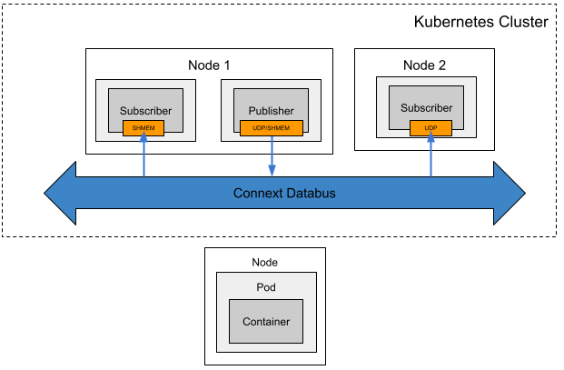

## Communications over Shared Memory

### Problem
You want to make Connext containers communicate over shared memory.

### Solution
Containers in a pod share the same IPC namespace, which means they can also communicate with each other using standard inter-process communications such as SystemV semaphores or POSIX shared memory. If containers are in the same pod, Connext containers with a version above 6.0 can communicate over shared memory with the default settings. (Please see [this](https://community.rti.com/kb/communicate-between-two-docker-containers-using-rti-connext-dds-and-shared-memory) if you use an older version.) A Connext container can use both Shared Memory for container-to-container communications (in the same pod) and UDP transport for pod-to-pod communications. 

### Required Docker Images
- [RTI Cloud Discovery Service](../dockerfiles/rti_clouddiscoveryservice)
- [RTI DDS Ping Publisher](../dockerfiles/rti_ddsping_pub)
- [RTI DDS Ping Subscriber](../dockerfiles/rti_ddsping_sub)

### Steps

#### Create a ConfigMap for RTI License.
`$ kubectl create configmap rti-license --from-file rti_license.dat`

#### Create a Deployment and a Service for Cloud Discovery Service.
`$ kubectl create -f rticlouddiscoveryservice.yaml`

#### Create a Deployment for the pod for DDS ping publisher and subscriber communicating over shared memory transport.
`$ kubectl create -f rtiddsping-shmem.yaml`

#### Create a Deployment for the pod for subscriber communicating over UDP transport.
`$ kubectl create -f rtiddsping-sub.yaml`