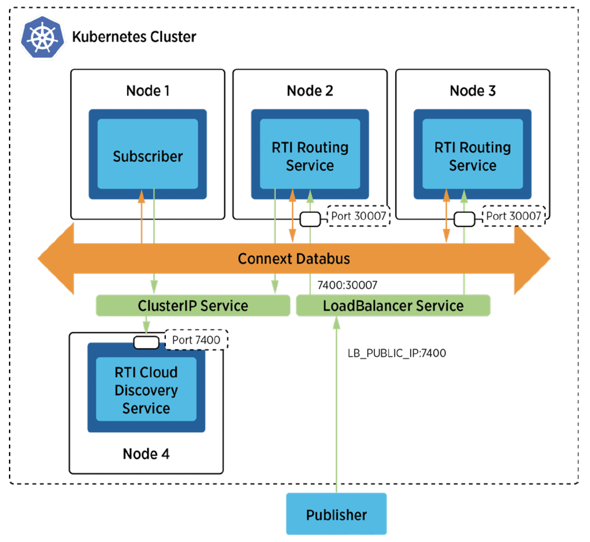

## Communicaitons Between External Applications And Pods Within a Kubernetes Cluster Using a Network Load-Balanced Gateway

### Problem

You need to ensure scalability and fault tolerance for Routing Services to accommodate varying loads and ensure high availability. 

### Solution

To address this challenge, deploying RTI Routing Services using a Kubernetes **Deployment** and **LoadBalancer service** facilitates scalability and high availability. A LoadBalancer Service, integrating with an external Network Load Balancer (NLB) provided by AWS, is utilized to expose the traffic of the Routing Services. This configuration allows the LoadBalancer Service, in conjunction with the external NLB, to distribute incoming traffic evenly from outside the cluster to multiple Routing Service pods, effectively scaling up the service in response to demand while maintaining high availability.

### Required Docker Images
- [RTI Routing Service](https://hub.docker.com/repository/docker/rticom/routing-service)
- [RTI Cloud Discovery Service](https://hub.docker.com/repository/docker/rticom/cloud-discovery-service)
- [RTI DDS Ping](https://hub.docker.com/repository/docker/rticom/dds-ping)

### Steps

#### 1. Create a ConfigMap for RTI License.
`$ kubectl create configmap rti-license --from-file rti_license.dat`

This command creates a ConfigMap to store the RTI License, required for running RTI Cloud Discovery Service and RTI Routing Service in the evaluation package.

#### 2. Create a Deployment and a ClusterIP Service for Cloud Discovery Service.
`$ kubectl create -f rticlouddiscoveryservice.yaml`

This command creates a Deployment and a Service for RTI Cloud Discovery Service, which is used for discovery between the internal DDS Subscriber and RTI Routing Service. 

#### 3. Create a ConfigMap for the Routing Service XML configuration file
`$ kubectl create configmap routingservice-rwt --from-file=USER_ROUTING_SERVICE.xml`

This command stores the Routing Service XML configuration file (USER_ROUTING_SERVICE.xml) as a ConfigMap, which can be updated as needed. 

#### 4. Create a LoadBalancer Service for Routing Service. 
`$ kubectl create -f rtiroutingservice_loadbalancer.yaml`

This step creates a LoadBalancer service for the RTI Routing Service to make the RTI Routing Service accessible and load balanced from external applications.

#### 5. Create a Deployment for the Routing Service. 

`$ kubectl get services rs-rwt`

Use this command to get the external DNS name (e.g., a709579e8e4db40248531847d6245779-0bc4e2a058d739ab.elb.us-east-2.amazonaws.com) assigned by AWS Network Load Balancer.

Then, you run the following command to get an public IP address from the DNS name. 

`$ nslookup a709579e8e4db40248531847d6245779-0bc4e2a058d739ab.elb.us-east-2.amazonaws.com`

**NOTE: Update the values for PUBLIC_IP with one of the external addresses in rtiroutingservice.yaml.**

`$ kubectl create -f rtiroutingservice.yaml`

Finally, running this command creates a Deployment for RTI Routing Service. 

#### 6. Create a Deployment for a RTI DDS Ping subscriber
`$ kubectl create -f rtiddsping_cds_sub.yaml`

This command deploys the internal RTI DDS Ping Subscriber, which uses Cloud Discovery Service for discovering the RTI Routing Service within the cluster.

#### 7. Run the external publisher (outside the cluster). You should update the public IP address and port in this file.

**NOTE: Adjust the initial_peer setting (using PUBLIC_IP:PUBLIC_PORT) in rwt_participant.xml.**

`$ rtiddsping -qosFile rwt_participant.xml -qosProfile RWT_Demo::RWT_Profile -publisher -domainId 100`

With these configurations, all necessary components should now be operational within the Kubernetes cluster. Execute the command above to run the external DDS Publisher application.
