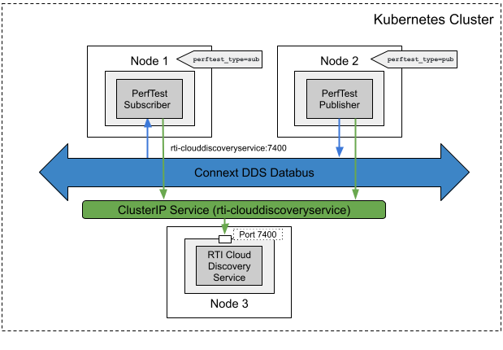

##  RTI PerfTest with RTI Cloud Discovery Service

### Problem

You want to conduct performance experiments on RTI Connext DDS applications within a Kubernetes cluster to assess their performance characteristics.

### Solution

To conduct performance experiments with RTI Connext DDS applications in a Kubernetes cluster, you can deploy RTI PerfTest application pods. Similar to other DDS applications, RTI PerfTest relies on RTI Cloud Discovery Service for discovery when your Container Network Interface (CNI) does not support multicast. Therefore, we deploy a pod for RTI Cloud Discovery Service and create a ClusterIP service for the pod. After deploying RTI PerfTest application pods, you can obtain the results of performance tests by examining the output logs of these application pods.

### Required Docker Images
- [RTI Cloud Discovery Service](../dockerfiles/rti_clouddiscoveryservice)
- [RTI PerfTest](../dockerfiles/rti_perftest)

### Steps
Follow these steps to set up and run performance experiments using RTI PerfTest with RTI Cloud Discovery Service in your Kubernetes cluster:

#### Create a ConfigMap for RTI License.
`$ kubectl create configmap rti-license --from-file rti_license.dat`

This command creates a ConfigMap to store your RTI license information, which is required for running RTI Connext DDS applications and services.

#### Create a Deployment and a Service for Cloud Discovery Service
`$ kubectl create -f rticlouddiscoveryservice.yaml`

Use this command to deploy a pod for RTI Cloud Discovery Service and create a ClusterIP service to support it.

#### Create a Deployment for PerfTest publisher
`$ kubectl create -f rtiperftest-cds-pub.yaml`

Deploy the RTI PerfTest publisher pod using this command. It will use RTI Cloud Discovery Service for discovery.

#### Create a Deployment for PerfTest subscriber
`$ kubectl create -f rtiperftest-cds-sub.yaml`

Similarly, deploy the RTI PerfTest subscriber pod using this command. It will also use RTI Cloud Discovery Service for discovery.

By following these steps, you can perform performance experiments on RTI Connext DDS applications within your Kubernetes cluster. The results of these experiments will be available in the output logs of the respective application pods.

Remember to adjust the configurations to meet your specific performance testing requirements, and ensure you have the necessary licenses and permissions to run RTI Connext DDS applications.
