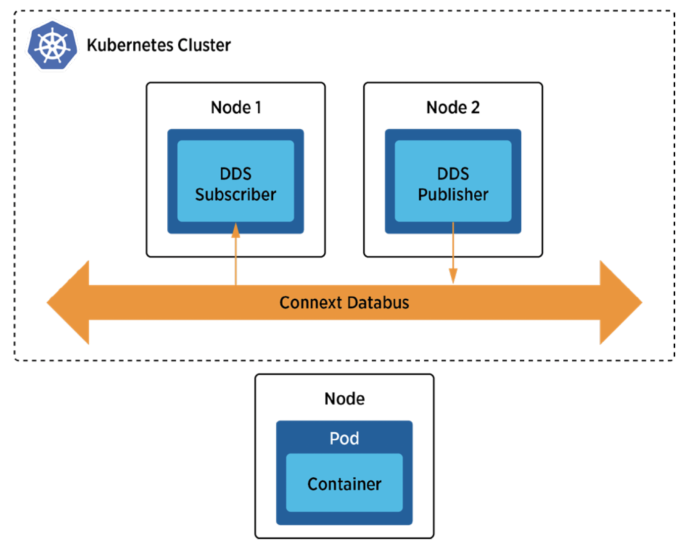

## Communications Between Pods Inside a Kubernetes Cluster via Multicast Discovery

### Problem

You need to establish communications between Connext DDS applications running in different pods within a k8s cluster. 

### Solution

When running Connext DDS applications in k8s, especially when leveraging a Container Network Interface (CNI) plugin supporting multicast (e.g., WeaveNet), you can enable automatic discovery between DDS application pods. The built-in discovery of DDS mechanism eliminates the need for a Kubernetes service for DDS discovery. DDS application pods can autonomously discover and establish connections with each other through topics, abstracting IP-based communications. This enables DDS application pods to communicate seamlessly within the cluster without relying on a Kubernetes service.

### Required Docker Images
- [RTI DDS Ping Publisher](../dockerfiles/rti_ddsping_pub)
- [RTI DDS Ping Subscriber](../dockerfiles/rti_ddsping_sub)

### Steps
Follow these steps to enable pod-to-pod communication for DDS applications within your Kubernetes cluster:

#### Create a Deployment for DDS ping publisher.
`$ kubectl create -f rtiddsping-pub.yaml`

This command deploys the RTI DDS Ping Publisher within your Kubernetes cluster.

#### Create a Deployment for DDS ping subscriber.
`$ kubectl create -f rtiddsping-sub.yaml`

Use this command to create a Deployment for the RTI DDS Ping Subscriber. This subscriber can now communicate with the previously deployed publisher.

These steps ensure that your DDS applications can communicate seamlessly within the Kubernetes cluster, leveraging DDS's built-in discovery mechanism. With this setup, you don't need to create an additional Kubernetes service for DDS discovery, simplifying your cluster configuration and communication setup.

Remember to adapt the configurations and images according to your specific use case, and ensure you have a Kubernetes cluster with a compatible networking plugin that supports multicast for DDS discovery.
