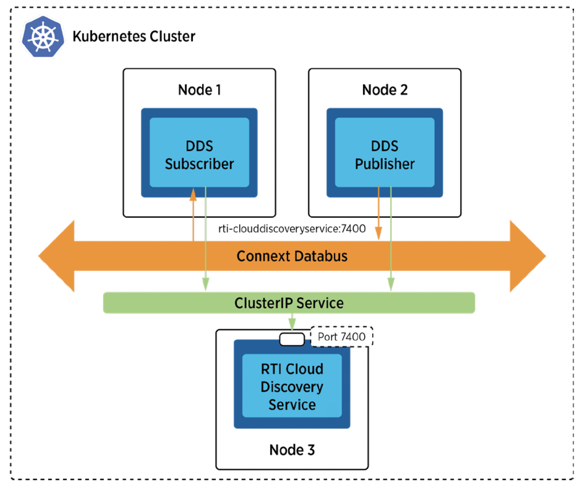
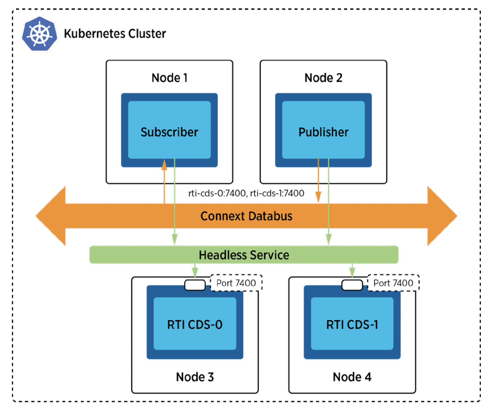

## Scenario 1 - Communications Between Pods Inside a Kubernetes Cluster via Unicast Discovery

### Problem

You want to enable DDS discovery within a Kubernetes cluster without relying on multicast. This is especially relevant as many Container Network Interface (CNI) plugins in Kubernetes do not support multicast.

### Solution

To address the multicast limitation in Kubernetes, you can leverage **RTI Cloud Discovery Service (CDS)**. CDS provides a solution for DDS discovery in environments where multicast is not supported. To use CDS, you need to add the IP address or DNS name and port number of the CDS to the initial peer lists of your Connext DDS applications. To get a stable IP address or DNS name within Kubernetes, you can employ a Cluster IP Service. Cluster IP is the default type of Kubernetes Service and exposes a pod on a stable internal IP in the cluster. With this, the pod for RTI CDS is reachable by DDS applications via a stable IP address or DNS name (e.g. rti-clouddiscovery:7400).

### Required Docker Images
- [RTI Cloud Discovery Service](../dockerfiles/rti_clouddiscoveryservice)
- [RTI DDS Ping Publisher](../dockerfiles/rti_ddsping_pub)
- [RTI DDS Ping Subscriber](../dockerfiles/rti_ddsping_sub)

### Steps
Follow these steps to enable DDS discovery without multicast within your Kubernetes cluster:

#### Create a ConfigMap for RTI License.
`$ kubectl create configmap rti-license --from-file rti_license.dat`

This command creates a ConfigMap to store the RTI License, which is necessary for running the RTI CDS in the evaluation package.

#### Create a Deployment and a Service for Cloud Discovery Service.
`$ kubectl create -f rticlouddiscoveryservice.yaml`

Deploy the RTI CDS using this command, which creats both a Deployment and a Service to create and expose the RTI CDS within the cluster. 

#### Create a Deployment for DDS ping publisher.
`$ kubectl create -f rtiddsping_cds_pub.yaml`

This command deploys the RTI DDS Ping Publisher, which uses the CDS for discovery within the Kubernetes cluster.

#### Create a Deployment for DDS ping subscriber.
`$ kubectl create -f rtiddsping_cds_sub.yaml`

Deploy the RTI DDS Ping Subscriber using this command. It leverages the CDS for DDS discovery, allowing communication with the RTI DDS Ping Publisher.

These steps ensure that your DDS applications can discover each other within the Kubernetes cluster even in environments that do not support multicast. By integrating the RTI Cloud Discovery Service and using a Cluster IP Service, you can manage discovery processes with multicast limitations in some Kubernetes environments.

## Scenario 2 - Communications Between Pods Inside a Kubernetes Cluster Using Redundant RTI Cloud Discovery Services

### Problem

Achieving high availability for the Cloud Discovery Service (CDS) within a Kubernetes environment is essential for ensuring continuous operation, especially in scenarios where service downtime is not acceptable.

### Solution

To achieve high availability of the RTI Cloud Discovery Service, deploying it via a **StatefulSet** combined with a **Headless Service** is recommended. StatefulSet ensures orderly and unique deployment of service instances, while the Headless Service provides a stable network identity. This setup creates a reliable domain name allowing Connext application pods to discover each other by adding the DNS names of the CDS services (e.g., rti-cds-0.rti-cds-hs.default.svc.cluster.local:7400) to their discovery peer lists. This configuration ensures that application pods can still communicate effectively even if one of the CDS instances fails.

### Required Docker Images
- [RTI Cloud Discovery Service](../dockerfiles/rti_clouddiscoveryservice)
- [RTI DDS Ping Publisher](../dockerfiles/rti_ddsping_pub)
- [RTI DDS Ping Subscriber](../dockerfiles/rti_ddsping_sub)

### Steps

#### Create a ConfigMap for RTI License.
`$ kubectl create configmap rti-license --from-file rti_license.dat`

This command creates a ConfigMap to store the RTI License, which is necessary for running RTI CDS in the evaluation package.

#### Create a StatefulSet and Headless Services for Cloud Discovery Service.
`$ kubectl create -f rticlouddiscoveryservice_ha.yaml`

This command deploys the RTI CDS using a StatefulSet alongside a Headless Service, setting up redundant CDS instances for enhanced availability. Each instance is accessible via a unique endpoint, such as rti-cds-0.

#### Create a Deployment for DDS ping publisher.
`$ kubectl create -f rtiddsping_cds_pub_ha.yaml`

This command deploys the RTI DDS Ping Publisher, which can now use redundant CDSes for discovery within your Kubernetes cluster.

#### Create a Deployment for DDS ping subscriber.
`$ kubectl create -f rtiddsping_cds_sub_ha.yaml`

This command creates a Deployment for the RTI DDS Ping Subscriber. It can also leverage redundant CDSes for discovery, allowing communication with the RTI DDS Ping Publisher.

Adjust the configurations and image names according to your specific DDS application and environment requirements.

Ensure that you have the necessary licenses and permissions for using RTI CDS.
