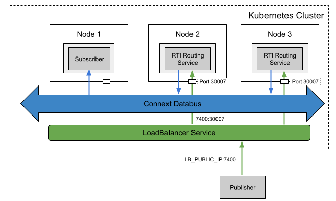

## Load Balancing Routing Services with Real-time WAN Transport

### Problem

You want to load balance Routing Services for scalability and high availability. This is an extended use case of [this](../routingservice_rwt). 

### Solution

To resolve this, a **Deployment** for **RTI Routing Services** can be used. To expose the traffic of the Deployment, **LoadBalancer Service** is be used with an external Load Balancer provided by AWS. **LoadBalancer Service** with the external load balancer balances the traffic from the outside of the cluster to multiple Routing Service pods. 

### Required Docker Images
- [RTI Routing Service](../dockerfiles/rti_routingservice)
- [RTI Cloud Discovery Service](../dockerfiles/rti_clouddiscoveryservice)
- [RTI DDS Ping Subscriber](../dockerfiles/rti_ddsping_sub)

### Steps

#### Create a ConfigMap for RTI License.
`$ kubectl create configmap rti-license --from-file rti_license.dat`

#### Create a Deployment and a Service for Cloud Discovery Service.
`$ kubectl create -f rticlouddiscoveryservice.yaml`

#### Create a ConfigMap for the Routing Service XML configuration file
`$ kubectl create configmap routingservice-rwt --from-file=config.xml`

#### Create a Deployment for the Routing Service. You should update the public IP address and ports in this file. 
`$ kubectl create -f rs-deployment.yaml`

#### Create a LoadBalancer Service for the Routing Service
`$ kubectl create -f rs-lb.yaml`

#### Create a Deployment for a RTI DDS Ping subscriber
`$ kubectl create -f rtiddsping-sub.yaml`

#### Run the external publisher (outside the cluster). You should update the public IP address and ports in this file.
`$ rtiddsping -qosFile rwt_participant.xml -qosProfile RWT_Demo::RWT_Profile -publisher -domainId 100`
