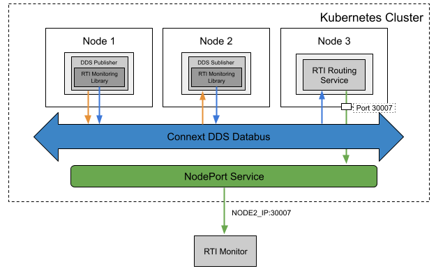

## Remotely Monitoring DDS Applications from Outside of a Cluster

### Problem

You want to monitor DDS applications in a Kubernetes cluster from the outside of the cluster. This is an extended use case of [this](../routingservice_rwt). 

### Solution

To resolve this, a **StatefulSet** for **RTI Routing Services** can be used. To expose the traffic of the StatefulSet, **NodePort Service** can be used with the static ports of a node IP address, mapping to each Routing Service. The exposed **RTI Routing Service** forwards DDS monitoring traffic to **RTI Monitor** running in the outside of the cluster. 



### Required Docker Images
- [RTI Routing Service](../dockerfiles/rti_routingservice)
- [RTI Cloud Discovery Service](../dockerfiles/rti_clouddiscoveryservice)
- [Shapes Publisher](../dockerfiles/shapes_pub)
- [Shapes Subscriber](../dockerfiles/shapes_sub)

### Steps

#### Create a ConfigMap for RTI License.
`$ kubectl create configmap rti-license --from-file rti_license.dat`

#### Create a Deployment and a Service for Cloud Discovery Service.
`$ kubectl create -f rticlouddiscoveryservice.yaml`

#### Create a ConfigMap for the QoS profile for Shapes publisher and subscriber applications.
`$ kubectl create configmap shapes-pub-config --from-file=shapes_pub_config.xml`\
`$ kubectl create configmap shapes-sub-config --from-file=shapes_sub_config.xml`

#### Create Deployments for the Shapes publisher and subscriber. 
`$ kubectl create -f rti-shapes-pub.yaml`\
`$ kubectl create -f rti-shapes-sub.yaml`

#### Create a ConfigMap for the Routing Service XML configuration file
`$ kubectl create configmap routingservice-rwt --from-file=config.xml`

#### Create a Deployment for the Routing Service. 
`$ kubectl create -f rs-statefulset.yaml`

#### Create a NodePort Service for the Routing Service
`$ kubectl create -f rs-nodeport.yaml`

#### Update the QoS profile for RTI Monitor (located under $NDDSHOME/resource/xml/RTI_MONITOR_QOS_PROFILES.xml with adding the following configurations for using RWT. Run RTI Monitor and join the domain for RWT (100 in this example configuration). 
```xml 
    <domain_participant_qos>
        <transport_builtin>
            <mask>UDPv4_WAN</mask>
            <udpv4_wan>
                <comm_ports>
                    <default>
                       <host>12345</host>
                    </default>
                </comm_ports>
            </udpv4_wan>
        </transport_builtin>
    </domain_participant_qos>
```
