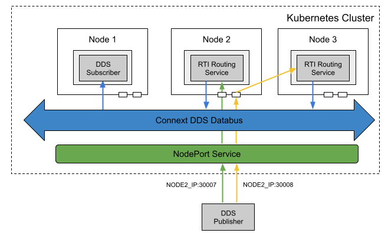

## Replicating Routing Services with Real-time WAN Transport

### Problem

You want to replicate Routing Services for high availability. This is an extended use case of [this](../routingservce_rwt). 

### Solution

To resolve this, a **StatefulSet** for **RTI Routing Services** can be used. To expose the traffic of the StatefulSet, **NodePort Service** can be used with the static ports of a node IP address, mapping to each Routing Service. StatefulSet replicate the traffic for a service while Deployment load balance the traffic. 

### Required Docker Images
- [RTI Routing Service](../dockerfiles/rti_routingservice)
- [RTI Cloud Discovery Service](../dockerfiles/rti_clouddiscoveryservice)
- [RTI DDS Ping Subscriber](../dockerfiles/rti_ddsping_sub)

### Steps

#### Create a ConfigMap for RTI License.
`$ kubectl create configmap rti-license --from-file rti_license.dat`

#### Create a Deployment and a Service for Cloud Discovery Service.
`$ kubectl create -f rticlouddiscoveryservice.yaml`

## Create a ConfigMap to initialize and run the Routing Service. You should update the public IP address and ports in this file.
`$ kubectl create -f init_configmap.yaml`

#### Create a ConfigMap for the Routing Service XML configuration file
`$ kubectl create configmap routingservice-rwt --from-file=config.xml`

#### Create a Deployment for the Routing Service. 
`$ kubectl create -f rs-statefulset.yaml`

#### Create a NodePort Service for the Routing Service
`$ kubectl create -f rs-nodeport.yaml`

#### Create a Deployment for a RTI DDS Ping subscriber
`$ kubectl create -f rtiddsping-sub.yaml`

#### Run the external publisher (outside the cluster). You should update the public IP address and ports in this file.
`$ rtiddsping -qosFile rwt_participant.xml -qosProfile RWT_Demo::RWT_Profile -publisher -domainId 100`
