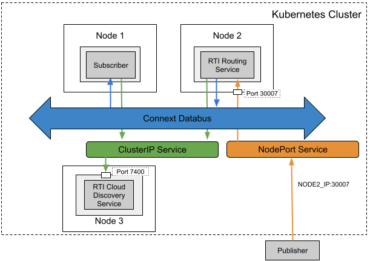

## Communicaitons Between External Applications and Pods Within a Kubernetes Cluster Using a Gateway

### Problem

When integrating DDS applications with a Kubernetes (k8s) cluster, the internal virtual network structure poses challenges. Each pod in a k8s cluster is assigned a virtual IP address, which is not directly accessible from outside the cluster. This isolation complicates direct communications with external applications that need to exchange data with applications running inside the cluster.

### Solution

To establish communication between internal and external DDS applications, we employ the **RTI Routing Service (RTI RS)** combined with **Real-time WAN Transport** as a gateway. A NodePort service is configured to expose the RTI Routing Service on a static port at each node's IP address, enabling external applications to interact with applicaitons within the cluster.

#### Required Components:

* **DDS Publisher and Subscriber**: These are example applications that demonstrate the data exchange.
* **Routing Service**: Acts as a gateway within the k8s cluster, forwarding data from the external DDS Publisher to the internal DDS Subscriber.
* **NodePort Service**: Created to expose the Routing Service on each node’s IP at a specified static port (e.g., Port 30007 as shown in the example diagram). External participants can access the Routing Service by using the address format NodeIP:NodePort (e.g., NODE2_IP:30007).

### Required Docker Images
- [RTI Routing Service (RS)](../dockerfiles/rti_routingservice)
- [RTI Cloud Discovery Service (CDS)](../dockerfiles/rti_clouddiscoveryservice)
- [RTI DDS Ping Subscriber](../dockerfiles/rti_ddsping_sub)

### Steps

#### 1. Create a ConfigMap for RTI License.
`$ kubectl create configmap rti-license --from-file rti_license.dat`

This command creates a ConfigMap to store the RTI License, which is necessary for running RTI CDS and RTI RS in the evaluation package.

#### 2. Create a Deployment and a ClusterIP Service for Cloud Discovery Service.
`$ kubectl create -f rticlouddiscoveryservice.yaml`

Use this command to create a Deployment and a Service for RTI CDS. RTI CDS is used for discovery between internal DDS Subscriber and RTI RS. 

#### 3. Create a ConfigMap for the Routing Service XML configuration file
`$ kubectl create configmap routingservice-rwt --from-file=config.xml`

This command creates a ConfigMap to store the Routing Service XML configuration file (config.xml). You can update the configuration file as needed. 

#### 4. Create a StatefulSet for Routing Service. 
`$ kubectl create -f rtiroutingservice.yaml`

Use this command to create a StatefulSet and NodePort service for RTI RS. 

**(NOTE: You should update the public IP address and ports in this file).***

#### 5. Create a Deployment for a RTI DDS Ping subscriber
`$ kubectl create -f rtiddsping-sub.yaml`

This command deploys the internal RTI DDS Ping Publisher, which can use CDS for discovering the RTI RS within the cluster.

#### 6. Run the external publisher (outside the cluster). 
`$ rtiddsping -qosFile rwt_participant.xml -qosProfile RWT_Demo::RWT_Profile -publisher -domainId 100`

Now, all components are running within the k8s cluster. You can use this command to run an external DDS Publisher application. 

**(NOTE: You should update the public IP address and ports in this file).**
