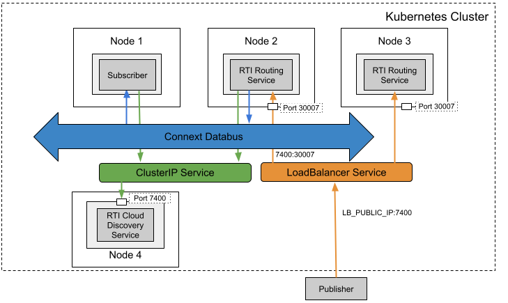

## Communicaitons Between External Applications And Pods Within a Kubernetes Cluster Using a Network Load-Balanced Gateway

### Problem

You want to load balance Routing Services for scalability and high availability. This is an extended use case of [this](../routingservice_rwt). 

### Solution

To resolve this, a **Deployment** for **RTI Routing Services** can be used. To expose the traffic of the Deployment, **LoadBalancer Service** is used with an external Network Load Balancer (NLB) provided by AWS. **LoadBalancer Service** with the external load balancer balances the traffic from the outside of the cluster to multiple Routing Service pods. 

### Required Docker Images
- [RTI Routing Service](../dockerfiles/rti_routingservice)
- [RTI Cloud Discovery Service](../dockerfiles/rti_clouddiscoveryservice)
- [RTI DDS Ping Subscriber](../dockerfiles/rti_ddsping_sub)

### Steps

#### 1. Create a ConfigMap for RTI License.
`$ kubectl create configmap rti-license --from-file rti_license.dat`

#### 2. Create a LoadBalancer Service for the Routing Service. 
`$ kubectl create -f rs-lb.yaml`

After this step, AWS will provide a DNS name (e.g., a709579e8e4db40248531847d6245779-0bc4e2a058d739ab.elb.us-east-2.amazonaws.com) for the LoadBalancer Service. You should use the DNS name in your RT WAN configurations in Step 4 and Step 7.

`$ kubectl get services rs-rwt`

`$ nslookup a709579e8e4db40248531847d6245779-0bc4e2a058d739ab.elb.us-east-2.amazonaws.com`

#### 3. Create a Deployment and a Service for Cloud Discovery Service.
`$ kubectl create -f rticlouddiscoveryservice.yaml`

#### 4. Create a ConfigMap for the Routing Service XML configuration file
`$ kubectl create configmap routingservice-rwt --from-file=config.xml`

#### 5. Create a Deployment for the Routing Service. You should update the public IP address and ports in this file. 
`$ kubectl create -f rs-deployment.yaml`

#### 6. Create a Deployment for a RTI DDS Ping subscriber
`$ kubectl create -f rtiddsping-sub.yaml`

#### 7. Run the external publisher (outside the cluster). You should update the public IP address and port in this file.
`$ rtiddsping -qosFile rwt_participant.xml -qosProfile RWT_Demo::RWT_Profile -publisher -domainId 100`
